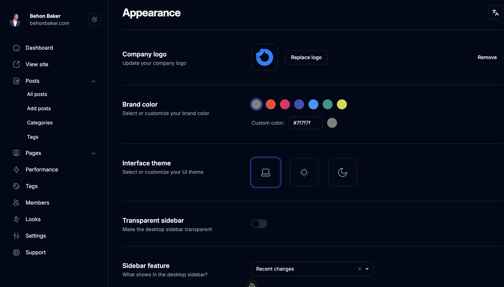

# Settings Dashboard

Another item added to the One Day collection. This time, a settings dashboard. I saw a design on dribble and decided to make my own version of it with the set of components I made for nuxt.

- [UI Thing](https://ui-thing.behonbaker.com/getting-started/introduction) - My library
- [Nuxt](https://nuxt.com/)
- [TailwindCSS](https://tailwindcss.com/)
- [Radix-Vue](https://www.radix-vue.com/)
- [Nuxt i18n](https://v8.i18n.nuxtjs.org/)




## Getting Started

- Clone the repo
- Change directory
- Install dependencies
- Run the dev server

```bash
git clone https://github.com/BayBreezy/one-day.git
cd settings-dash
npm install
npm run dev
```
